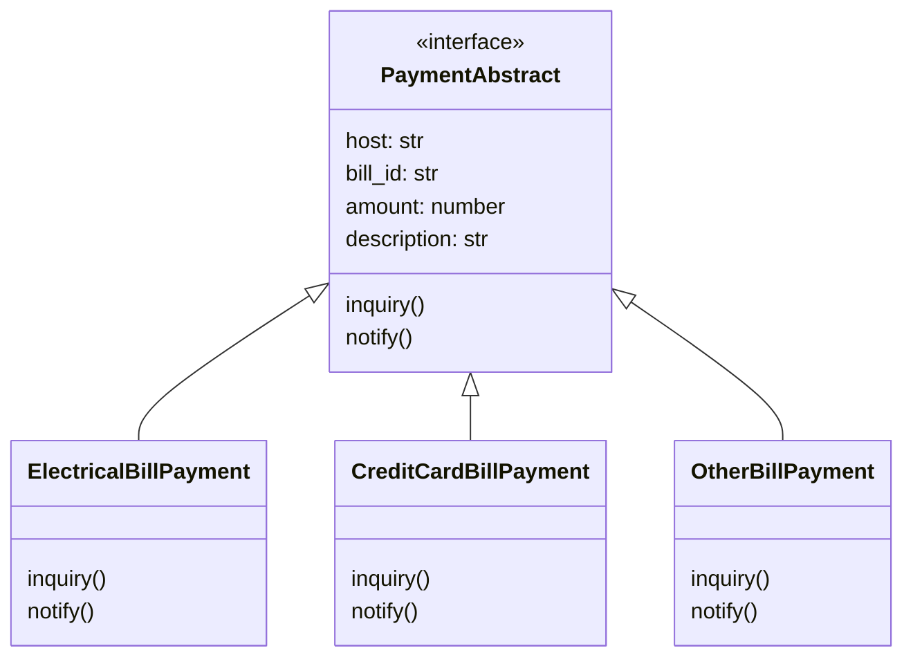

```mermaid
classDiagram 

    PaymentAbstract <|-- ElectricalBillPayment
    PaymentAbstract <|-- CreditCardBillPayment
    PaymentAbstract <|-- OtherBillPayment

    class PaymentAbstract{
        <<interface>>
        host: str
        bill_id: str
        amount: number
        description: str

        inquiry()
        notify()
    }

    class ElectricalBillPayment{
        inquiry()
        notify()
    }

    class CreditCardBillPayment{
        inquiry()
        notify()
    }

    class OtherBillPayment{
        inquiry()
        notify()
    }
```

class Payment{
        host: str
        bill_id: str
        amount: number
        description: str

        inquiry()
        notify()
    }