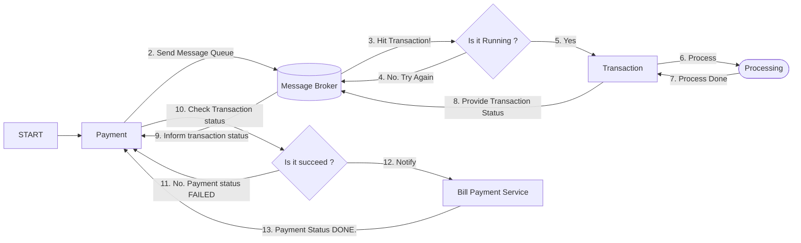

```mermaid
    flowchart LR
        D[START] --> Payment
        Payment -- 2. Send Message Queue --> MessageBroker[(Message Broker)]
        MessageBroker[(Message Broker)] -- 3. Hit Transaction! --> A{ Is Running ? }
        A{Is it Running ?} -- 4. No. Try Again --> MessageBroker[(Message Broker)]
        A{Is it Running ?} -- 5. Yes --> Transaction
        Transaction -- 6. Process --> C([Processing ])
        C([Processing]) -- 7. Process Done --> Transaction
        Transaction -- 8. Provide Transaction Status --> MessageBroker[Message Broker]
        MessageBroker[(Message Broker)] -- 9. Inform transaction status  --> Payment
        Payment -- 10. Check Transaction status --> B{ Is it succeed ? }
        B{ Is it succeed ? } -- 11. No. Payment status FAILED --> Payment
        B{ Is it succeed ? } -- 12. Notify --> BillPaymentService[Bill Payment Service]
        BillPaymentService[Bill Payment Service] -- 13. Payment Status DONE. --> Payment 
```