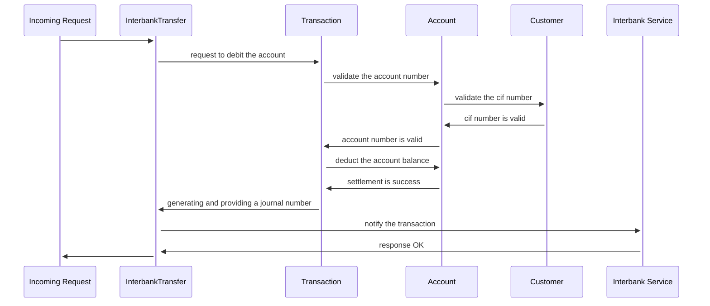

```mermaid
sequenceDiagram
    Incoming Request->>+InterbankTransfer: 
    InterbankTransfer->>+Transaction: request to debit the account
    Transaction->>+Account: validate the account number
    Account->>+Customer: validate the cif number
    Customer->>+Account: cif number is valid
    Account->>+Transaction: account number is valid
    Transaction->>+Account: deduct the account balance
    Account->>+Transaction: settlement is success
    Transaction->>+InterbankTransfer:  generating and providing a journal number
    InterbankTransfer->>+Interbank Service: notify the transaction
    Interbank Service->>+InterbankTransfer: response OK
    InterbankTransfer->>+Incoming Request: 
```