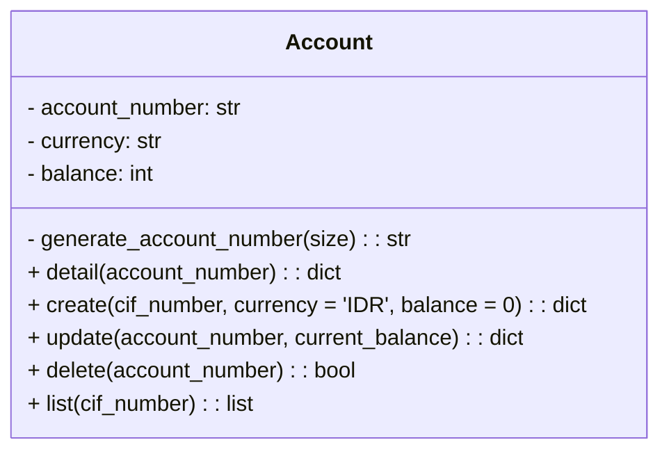

```mermaid
classDiagram

    class Account{
        - account_number: str
        - currency: str
        - balance: int
        - generate_account_number(size): str
        + detail(account_number): dict
        + create(cif_number, currency = 'IDR', balance = 0): dict
        + update(account_number, current_balance): dict
        + delete(account_number): bool
        + list(cif_number): list
    }

```   