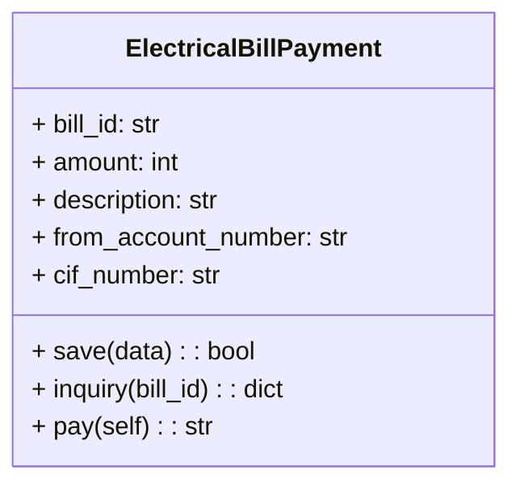

```mermaid
classDiagram

    class ElectricalBillPayment{
        + bill_id: str
        + amount: int
        + description: str
        + from_account_number: str
        + cif_number: str

        + save(data): bool
        + inquiry(bill_id): dict
        + pay(self): str
    }

```   