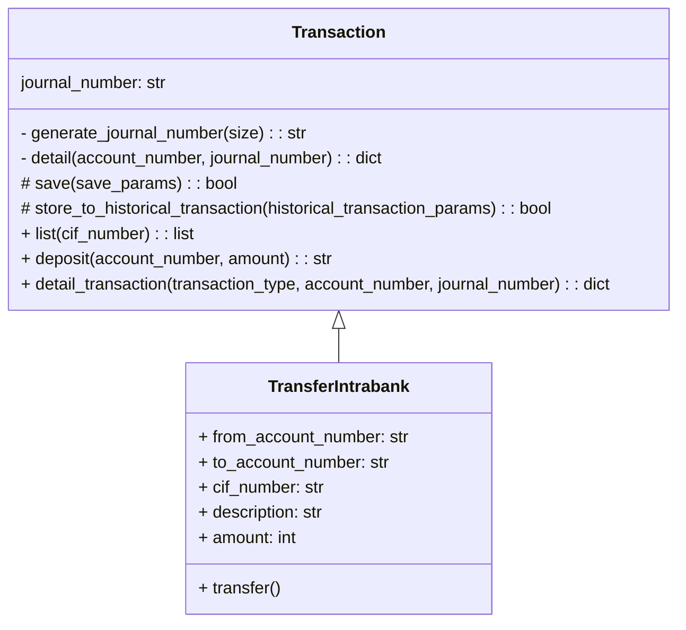

```mermaid
classDiagram

    Transaction <|-- TransferIntrabank
    
    class Transaction{
        journal_number: str
        - generate_journal_number(size): str
        - detail(account_number, journal_number): dict
        # save(save_params): bool
        # store_to_historical_transaction(historical_transaction_params): bool
        + list(cif_number): list
        + deposit(account_number, amount): str
        + detail_transaction(transaction_type, account_number, journal_number): dict
    }

    class TransferIntrabank{
        + from_account_number: str
        + to_account_number: str
        + cif_number: str
        + description: str
        + amount: int
        + transfer()
    }

```   