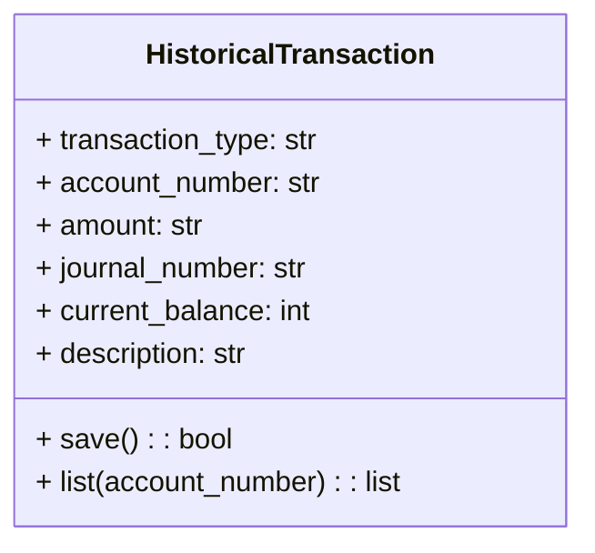

```mermaid
classDiagram

    class HistoricalTransaction{
        + transaction_type: str
        + account_number: str
        + amount: str
        + journal_number: str
        + current_balance: int
        + description: str

        + save(): bool
        + list(account_number): list
    }

```   