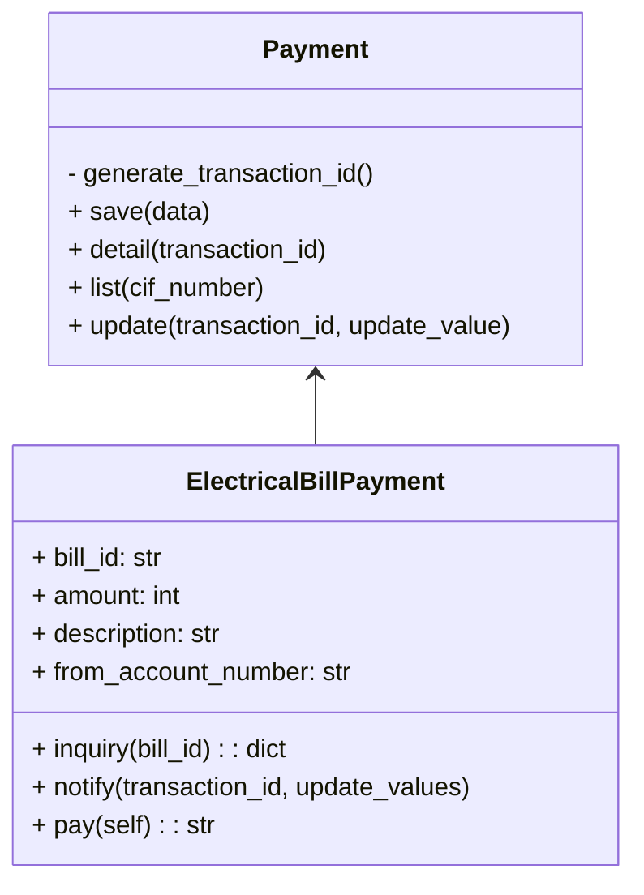

```mermaid
classDiagram

    Payment <-- ElectricalBillPayment

    class Payment{
        - generate_transaction_id()
        + save(data)
        + detail(transaction_id)
        + list(cif_number)
        + update(transaction_id, update_value)
    }

    class ElectricalBillPayment {
        + bill_id: str
        + amount: int
        + description: str
        + from_account_number: str

        + inquiry(bill_id): dict
        + notify(transaction_id, update_values)
        + pay(self): str
    }

```   