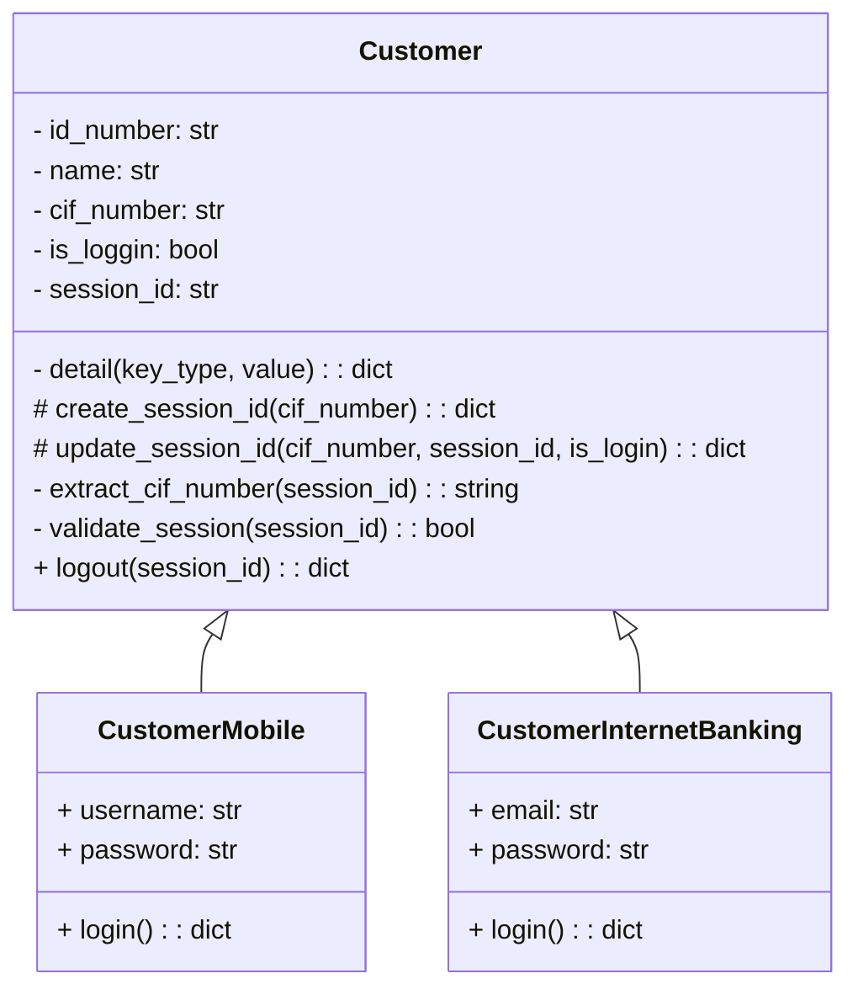

```mermaid
classDiagram

    Customer <|-- CustomerMobile
    Customer <|-- CustomerInternetBanking
    
    class Customer{
        - id_number: str
        - name: str
        - cif_number: str
        - is_loggin: bool
        - session_id: str

        - detail(key_type, value): dict
        # create_session_id(cif_number): dict
        # update_session_id(cif_number, session_id, is_login): dict
        - extract_cif_number(session_id): string
        - validate_session(session_id): bool
        + logout(session_id): dict
        
    }

    class CustomerMobile{
        + username: str
        + password: str
        + login(): dict
    }

    class CustomerInternetBanking{
        + email: str
        + password: str
        + login(): dict
    }

```   