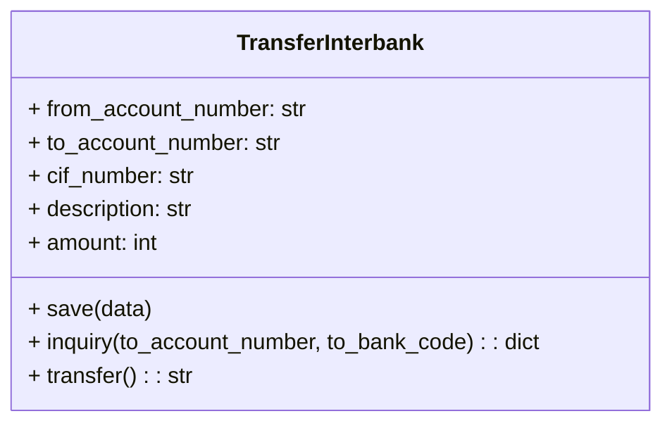

```mermaid
classDiagram

    class TransferInterbank{
        + from_account_number: str
        + to_account_number: str
        + cif_number: str
        + description: str
        + amount: int

        + save(data)
        + inquiry(to_account_number, to_bank_code): dict
        + transfer(): str
    }

```   